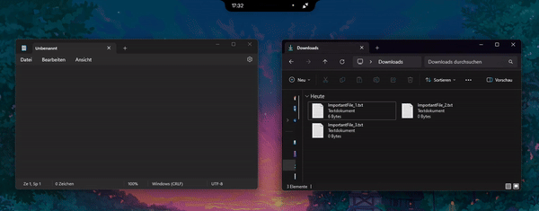
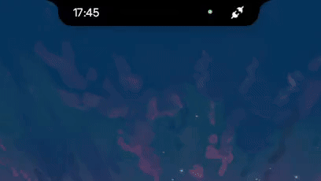
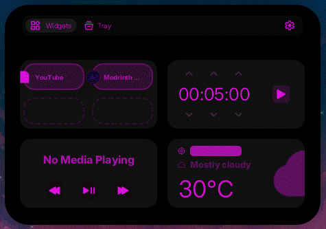
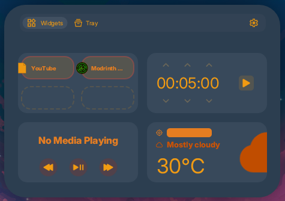
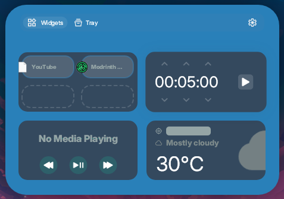
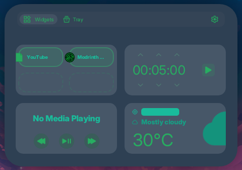
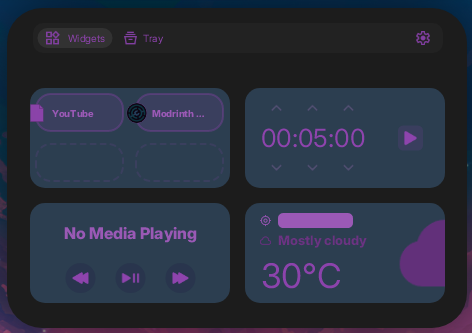
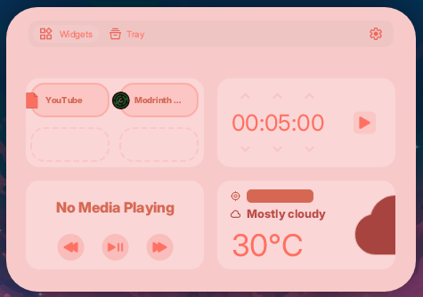

# DynamicWin

<p align="center">
  
  <a href="https://opensource.org/license/mit"></a>
  <a href="https://www.youtube.com/@flofdev"></a>
  <a href="https://discord.gg/UHFuqB9NqR"></a>
</p>

<p align="center">
  
</p>

### What is it?
A [Dynamic Island](https://support.apple.com/de-de/guide/iphone/iph28f50d10d/ios) inspired Windows App that brings in a bunch of features like widgets or a file tray that works like a clipboard.

### Why did I make this?
The idea for this application originally came to me when I saw the dynamic island on iPhone for the first time. After seeing that there are no (good) solutions to a Dynamic Island type application on Windows, I got the idea to make my own.
I only got the motivation to start on it though, after seeing something similar has been done on macOS already [(NotchNook)](https://lo.cafe/notchnook).
<br><br>
I love programming and I had the idea stuck in my mind for quite some time now. <br>
I originally made the project in [Java](https://www.java.com/de/) (luckily, that changed) but didn't get any progress since Java is less connected to the Operating system than a language like C#. <br>
I re-made the project in [WinForms](https://de.wikipedia.org/wiki/Windows_Forms) getting way better results and being more motivated and then had to migrate it to  [WPF](https://de.wikipedia.org/wiki/Windows_Presentation_Foundation) because of my stupid mistake of not trying if things would actually work before doing it. (:D)

### How did I make this?
WPF is a powerful UI framework, however to archive the look and feel of this app I decided on creating every UI element from scratch using [SkiaSharp](https://github.com/mono/SkiaSharp) for the rendering. This allowed me to create an app that looks like something you would find on macOS which was perfect for this project.

### Why am I writing all of this instead of talking about the features?
I wanted to give you a peak at what went into this project and why/how I made it.

# Features
> [!NOTE]
> Only the checked features are currently available. The unchecked ones are not guaranteed to come, but are on my mind.

DynamicWin has a variety of features, currently including: <br>

## Shortcuts
- [x] `Ctrl + Win` Will hide the island (or show it again).
- [ ] `Shift + Win` Will open a quick search menu.

## Big Widgets
- [x] Media Playback Widget
- [x] Timer Widget
- [x] Weather Widget
- [ ] Voicemeeter integration Widget
- [x] Shortcuts Widget <sub>(Can be configured to open a file, e.g. Shortcut, .EXE or any other filetype.)</sub>
- [ ] Calendar Widget
- [ ] Tuya Smart integration <sub>(Will probably be turned in to one widget with the shortcuts)</sub>

## Small Widgets
- [x] Time Display
- [x] Music Visualizer
- [x] Device Usage Detector <sub>(Indicates if camera / microphone is in use)</sub>
- [x] Power State Display <sub>(Shows battery in form of icons. If no battery is found it shows a connector icon instead)</sub>
- [x] Timer <sub>(Displaying current running timer)</sub>
- [x] CPU/GPU Usage Display

## File Tray <br>

<p align="center">
  
</p>

Files can be dragged over the island to add them to the file tray. The tray can be accessed when hovering over the island and clicking on the 'Tray' button. The files are stored until they are dragged out again. They can also be removed by selecting the file and right clicking. A context menu will popup and you can click on - **"Remove Selected Files"** or **"Remove Selected Files"** to copy the files. <br>
Idea for the future: An implementation of a service like [SnapDrop](https://snapdrop.net) to allow for an "AirDrop" kind of feature using the file tray.

## Spotify Integration

<p>The Media Playback Widget automatically detects when an instance of the Spotify app is running (Desktop version only). It will display the current playing song name and the artist. Login to the Spotify service on the app is <b>not</b> required.</p>
<br><br><br>

## Mod Support
**Yes! You can add your own small widgets and big widgets by creating a custom extension!** <br>
Loading an extension from someone else is very simple. You just need to drag the **Mod.dll** file in to the *Extensions* folder that is located in the `%appdata%/DynamicWin` directory. 

> [!WARNING]
> **Please never load a mod that is not tested to be safe!**

Mods can contain malicious code that can mess up your system, so always check a mod's source code or let a trustworthy person check it for you.

## Custom Themes

<div style="display: flex; justify-content: center; flex-wrap: wrap; gap: 25px; margin:25px">
  
  
  
  
  
  
</div>

> [!INFO]
> The above shown themes were generated by ChatGPT. If you want one of them, join the discord and let me know.

You can use the built-in dark / light theme. You can also create custom themes that fit your liking by going to the `%appdata%/DynamicWin/Theme.json` file. After editing the colors you need to select the `Custom` theme option in the settings. If you already did that, you will need to go back to the settings and click on it again. Otherwise you would have to restart the app.
<br>
This is an example of a color:
`"IslandColor": "#000000"`
<br>
The hex code is structured this way: `#rrggbb`. If you want to change the alpha of the color, it is **always** at the start of the code. `#aarrggbb`.

# Known Issues
The performance might not be the best. I will try my best to add performance options to the settings menu but cannot guarantee a smooth experience for everyone. <br><br>

The app might suddenly disappear and upon trying to reopen it a message box will tell you that only one instance of the app can run at the same time. To fix this, open task manager and find the process "DynamicWin". Kill it and start the app again. <br><br>

Too fast interactions might confuse the animation system and will result in an empty menu. To fix this, usually moving the mouse away from the island and then over it again will fix it.

# Creating an Extension
To create an extension you need an IDE like [Visual Studio](https://visualstudio.microsoft.com/de/vs/community/).
- Create a new C# Project of the type "Class Library". The target framework has to be `.NET 8`.
- You will need to add at least `DynamicWin.dll` and the SkiaSharp DLLs as assembly dependencies to your project. [How to add references to a VS project](https://learn.microsoft.com/en-us/visualstudio/ide/how-to-add-or-remove-references-by-using-the-reference-manager?view=vs-2022)
- Create a new C# class file, if it's not already there. Rename the class to something like "MyExtension".
- All extensions must have a class that implements the `IDynamicWinExtension` interface.<br>

Here is an example of how the extension class should look like:

```cs
public class TestExtension : IDynamicWinExtension
{
    public string AuthorName => "Florian Butz"; // The display name of the author (you) of the extension

    public string ExtensionName => "Test Extension"; // The dislpay name of the extension

    public string ExtensionID => "florianbutz.test"; // The ID of the extension

    public List<IRegisterableWidget> GetExtensionWidgets() // Returns all Widgets that are available in this extension
    {
        return new List<IRegisterableWidget>() { }; // Creates a list with all IRegisterableWidgets in this extension
    }

    public void LoadExtension() // Gets executed after DynamicWin has finished loading in all extensions and has created the window
    {
        System.Diagnostics.Debug.WriteLine(ExtensionName + " was loaded sucessfully!"); // Debug text
    }
}
```

Now you can create your first widget. Create a new class and call it how you want. I will call mine `TestWidget` for now. The class has to implement from `WidgetBase` if it is a big widget. If you want to make a small widget, extend the class from `SmallWidgetBase`.

```cs
public class TestWidget : WidgetBase
{
    DWText text; // Reference for the text object

    public TestWidget(UIObject? parent, Vec2 position, UIAlignment alignment = UIAlignment.TopCenter) : base(parent, position, alignment) // Overriding the constructor is essential.
    {
        text = new DWText(this, "This is a Text!", Vec2.zero, UIAlignment.Center); // Creates a new text object
        AddLocalObject(text); // Adds an object to the UIObject (Widget)
    }

    public override void DrawWidget(SKCanvas canvas) // Gets called when the widget is drawn. Do not override 'Draw()' since it contains other important things.
    {
        var paint = GetPaint(); // Creates a new paint of the UIObject. Please only use this and don't create your own paint.
        paint.Color = Theme.Primary.Value(); // Sets the color of the paint to the current Primary color

        var rect = GetRect(); // Gets the rect / bounds of the widget

        canvas.DrawRoundRect(rect, paint); // Draws the rect to the screen. Only use 'DrawRoundRect()' when trying to draw the bounds of the UIObject.
    }
}
```

DynamicWin needs to know what widgets are in your extension. To register the widget, create a new class that implements from the `IRegisterableWidget` class. For readability reasons I'll call mine `RegisterTestWidget`.

```cs
public class RegisterTestWidget : IRegisterableWidget
{
    public bool IsSmallWidget => false; // Determins if the widget is supposed to be small or big (small widgets are displyed when the island is not hovered)

    public string WidgetName => "Test Widget"; // The display name of the widget

    public WidgetBase CreateWidgetInstance(UIObject? parent, Vec2 position, UIAlignment alignment = UIAlignment.TopCenter) // Overriding the constructor is essential.
    {
        return new TestWidget(parent, position, alignment); // Needs to return the Widget that you are trying to register
    }
}
```

Now the extension is almost ready. As a last step, go back to your main extension class and add the `RegisterTestWidget` (or however you called it) class to the `GetExtensionWidgets()` function's return list.

```cs
public List<IRegisterableWidget> GetExtensionWidgets() // Returns all Widgets that are available in this extension
{
    return new List<IRegisterableWidget>() { new RegisterTestWidget() }; // Creates a list with all IRegisterableWidgets in this extension
}
```

Now you're done. Build the project and go to your project's output folder. (Most times located under `\bin\Debug\net8.0\` or `\bin\Release\net8.0\` and move **ONLY** the DLL file that has the name of your project in to the `%appdata%/DynamicWin/Extensions` folder. In this case, my output DLL is called `TestExtension.dll`. <br><br>
After that you can run DynamicWin and test your extension. This was of course a very bare bones example.

> [!TIP]
> It's best to look at the widgets that are already in DynamicWin and learn from them.

<br>
Here is a small list of current UIObjects that can be used to make the widget creation process easier.

## UIObject
  - Constructor
    - `UIObject? parent` is the parent UIObject, most times the widget itself.
    - `Vec2 position` is the position of the UIObject.
    - `Vec2 size` is the size of the UIObject.
    - `UIAlignment alignment` is an optional paramenter which determins where inside the parent the object's zero point is.
  - Important Methods
    - `SetActive(bool)` sets the active state of the UIObject with an animation.
    - `SilentSetActive(bool)` sets the active state of the UIObject without an animation.
    - `SKRoundRect GetRect()` returns the bounds of the UIObject (`SKRoundRect`);
    - `ContextMenu? CreateContextMenu()` is overriden if the UIObject is supposed to have a context (right click) menu using the WPF `ContextMenu` class.
    - `AddLocalObject(UIObject)` adds another UIObject inside the UIObject that called it. Parent is automatically set to the caller UIObject.
    - `DestroyLocalObject(UIObject obj)` removes the local UIObject.
    - `GetColor(Col)` takes in a color and returns the same color but with correct transparency. Please use it whenever you use custom colors or colors from the Theme class.
  - Important Fields / Properties
    - `IsHovering` returns true if the mouse is over the UIObject.
    - `IsMouseDown` returns true if the mouse is down over the UIObject. 
    - `Color` returns the color of the object.
    - `Position` returns the position of the object.
    - `RawPosition` returns the actual position of the object without the screen transformation (use this when setting the `Position` field).
    - `Anchor` is the anchor of the object. By default set to `(0.5f, 0.5f)` which means zero is in the middle of the UIObject.
    - `Size` returns the size of the object.
    - `IsEnabled` returns the active state of the UIObject.

## DWText
  - Constructor
    - `string text` is the text.
  - Important Methods
    - `SetText(string)` sets the text with an animation.
    - `SilentSetText(string)` sets the text without an animation.
  - Important Fields / Properties
    - `Font` is the Typeface of the text.
    - `TextBounds` are the bounds of the text.
    - `TextSize` is the size of the text.

## WTextImageButton
(Do not use. This is the base class of `DWTextButton`, `DWImageButton` and `DWTextImageButton`)
  - Constructor
    - `Action clickCallback` is an action that gets called on click.
  - Important Fields / Properties
    - `normalColor` is the color of the button when not hovered.
    - `hoverColor` is the color of the button when hovered.
    - `clickColor` is the color of the button when clicked.
    - `colorSmoothingSpeed` is the speed at which the color updates.
    - `normalScaleMulti` is the size of the button when not hovered.
    - `hoverScaleMulti` is the size of the button when hovered.
    - `normclickScaleMultialScaleMulti` is the size of the button when clicked.


## DWTextButton
  - Constructor
    - `string buttonText` is the text on the button.
  - Important Fields / Properties
    - `normalTextSize` is the size of the text when not hovered.

## DWImageButton
  - Constructor
    - `SKBitmap image` is the image on the button.
  - Important Fields / Properties
    - `imageScale` the scale multiplier of the image. Default is `0.85f`. `1f` would be the scale of the button.
    - `Image` the image of the button.
    
## DWTextImageButton
  - Constructor
    - `SKBitmap image` is the text on the button.
    - `string buttonText` is the text on the button.
    - `Action clickCallback` is an action that gets called on click.
  - Important Fields / Properties
    - `imageScale` the scale multiplier of the image. Default is `0.85f`. `1f` would be the scale of the button.
    - `normalTextSize` is the size of the text when not hovered.
    - `Image` the image of the button.

The `Res` class can be used to load in SKTypeface or SKBitmap (for DWText or DWImage).
For colors the `Col` class is used. When applying the color to the paint `Col.Value()` has to be called to convert to `SKColor`. <br>
Try to only use the colors available in the `Theme` class to provide color customizability to the user.
